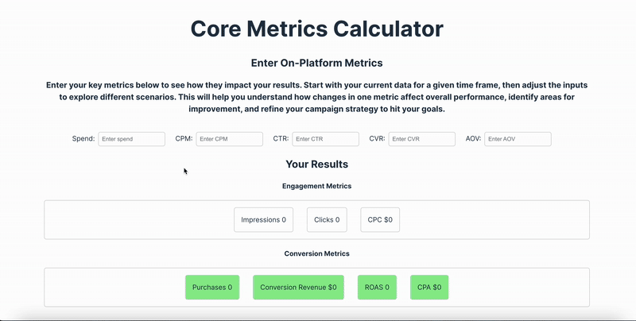

# Core Metrics Calculator

This calculator is a web application designed to help digital media buyers visualize how the change in certain metrics impacts performance. This tools helps advertisers make account optimizations and illustrate to clients why they're being made!

It allows users to enter their on-platform metrics that you can influence, and outputs the engagement and performance metrics that result. This was built as a personal project to bridge the gap between my experience in digital advertising and as a developer, and answers the questions media buyers ask daily: why am I getting these performance results and what should I do about it?



## Features

- Enter Spend, CPM, CTR, AOV, and CVR metrics
- See how results change when the above metrics change

## Features on Deck

- Ability to add and compare results against your goals
- Add a timeframe with a guide on how many purchases still needed to leave the learning phase
- Have calculators for different platforms or industries (Google vs. Meta, Saas vs Ecom)
- Ability to add custom metrics (if your KPI is anything other than purchases/revenue)
- Include LTV calculations for more in-depth campaign planning

## Built With

- [**React**](https://react.dev/) - Used for building the dynamic user interface of the app.
- [**Firebase**](https://firebase.google.com/) - Used for functions and hosting, providing backend services and deployed site.
- **Vanilla CSS** - Styles the application, using flexbox and media queries for responsive design.
- **React Context** - Manages global state across the app without prop-drilling, simplifying state sharing.
- **React State** - Manages component state for interactive features such as form inputs and toggles.

## Getting Started

To view the deployed site, click [here](https://core-metrics-calculator.web.app/).
Otherwise, follow the instructions below to get the project up and running on your local machine.

### Prerequisites

Make sure you have the following installed:

- [npm](https://www.npmjs.com/)

### Installation

1. Clone the repository:

```
git clone https://github.com/maiyajanay/core-metrics-calculator.git
```

2. Navigate to the correct directory

```
cd core-metrics-calculator
cd frontend
```

3. Install the dependencies:

```
npm install
```

### Running the Application

1. Start the development server:

```
npm run dev
```

## Authors

- **Maiya Hoard** - [LinkedIn](https://www.linkedin.com/in/maiyahoard/)

## Acknowledgments

- Max Rosewater
- Nahshon Cook-Nelson

## Contact

If you have any questions or feedback, feel free to reach out to me at [maiyajanay@gmail.com].
